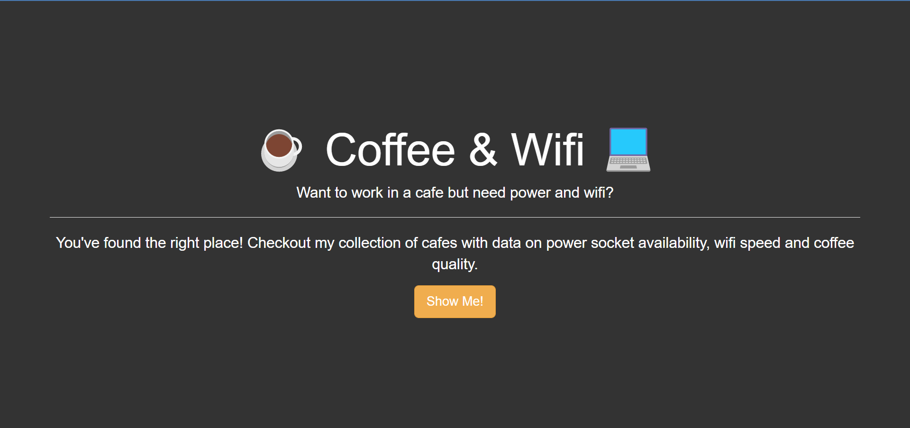
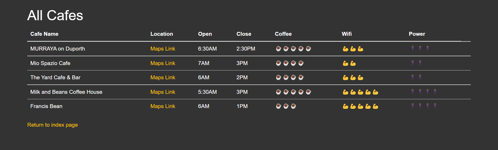
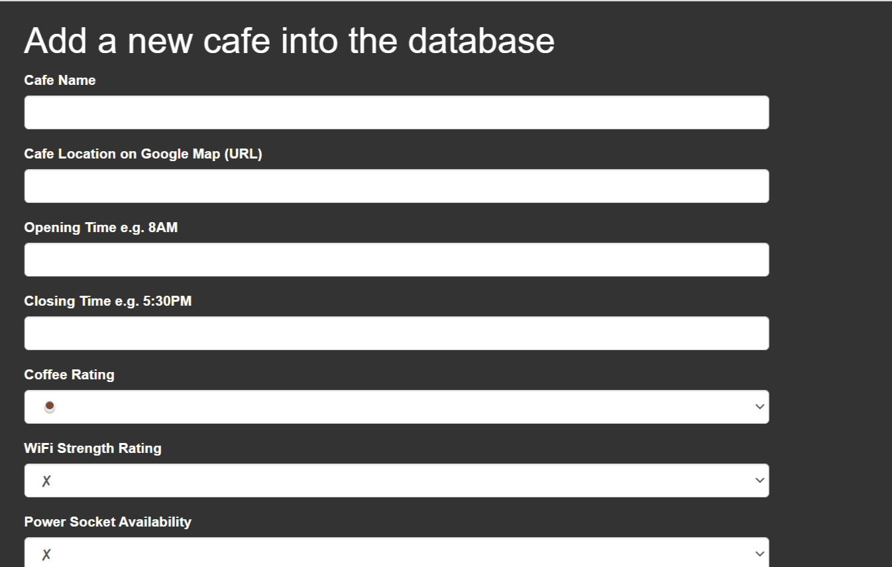

#Checkout my collection of cafes with data on power socket availability, wifi speed and coffee quality.

This a web app that containt a list of coffee shops
in Maroochydore, QLD.
that if you want to work on those cafe you can 
have an idea of what to expect
Once you click on Show Me! button it take the user 
to a list of coffee shops with a link to google map
to see the coffee shop address, open and closing 
time, rate of coffee, wifi and power socket availability.

this app is build with:
Python
Flask and FlaskForm
Bootstrap
csv

to have access to to a form and add a coffee shop to the list
with detail to the list, you need to add at the root
url /add .

